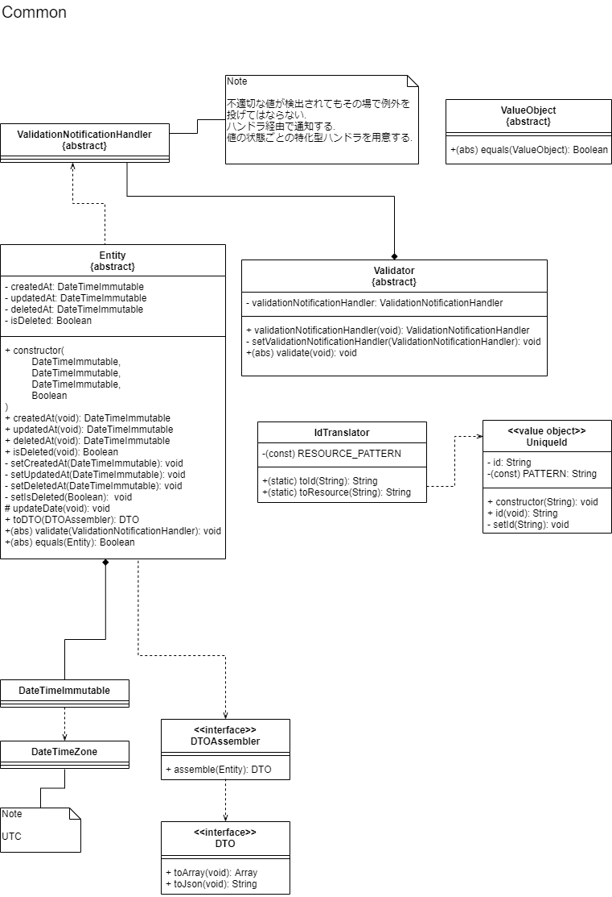

　「実践ドメイン駆動設計」※1を参考に，ドメイン駆動設計(以下，DDD)を適応したWEBアプリケーションのコアモジュールを作成した．未完成ではあるが，メインの機能は実装済みである．

#### DDDを学んだ経緯
---
　趣味でWEBアプリケーションを開発する中で，時間が経つと理解ができなくなるコードを書いていることに気が付いた．理解ができなくなる理由は，たくさんの処理を1つの関数に詰め込み過ぎており，一部を理解するのに広範囲のコードを読む必要があるためだと分かった．この煩雑さを解消するためのコードの書き方を調べていると，オブジェクト指向プログラミングにおけるデザインパターンやSOLID原則といった，品質の良いコードを書く上での考え方に出会った．勉強を続けると，これらオブジェクト指向プログラミングの基本が詰まった設計の考え方にたどり着き，それがDDDであった．

#### WEBアプリケーションの概要
---
- ユーザーが主にできることは以下の2つ．
    - 記事(Item)の作成・編集・削除・閲覧
    - 記事の関連性(Map)を登録し，情報を体系的に整理
- アーキテクチャとして，ヘキサゴナルアーキテクチャを採用した．DDDは特定のアーキテクチャを想定していないため，今回のような小規模なアプリケーションであればシンプルなレイヤーアーキテクチャを採用した方が工数は減るが，今回は学習に重きを置いているため，参考文献※1で採用されているヘキサゴナルアーキテクチャを採用した．
- フレームワークとしてLaravelを採用することを想定している．
- データベースは，MySQLを採用することを想定している．

#### DDDの適応
---

##### コアドメインとサブドメイン
　ユーザーがこのWEBアプリケーションを利用する理由となるメイン機能部分，すなわち記事作成・編集・削除・閲覧と情報の整理機能をコアドメインとし，ユーザー情報の管理機能部分をサブドメインとした．

##### コアドメイン構成

- ##### ドメイン層
    src/ItemMap/DomainModel/

    　ビジネスロジックを有する処理は基本的にこの層に配置される．ドメイン層にある要素(ドメインモデル)は大きく分けて，「集約(エンティティ)」，「値オブジェクト」，「ドメインサービス」，「ファクトリ」，「リポジトリ」である．なお，「リポジトリ」の具体的な処理はポート&アダプタ層で実装しており，ドメイン層にはインターフェースの形式で配置している．これは，永続化処理はデータベースの仕様やORマッパーの仕様に依存するためである．

- ##### アプリケーション層
    src/ItemMap/Application/

    　ユースケースごとの一連の処理を実装する．ビジネスロジックを有するドメインモデルのクライアントとなる．データベースのトランザクションコントロールもここで行う．コアモジュールをLaravelに搭載する場合は，コントローラー内でアプリケーションサービスのインスタンスを生成し(DIコンテナを使用することも可能)，アプリケーションサービスのメソッドを実行し，UI層にデータを渡す．

- ##### ポート&アダプタ層
    src/ItemMap/PortAdapter/

    　ドメイン層の外側の要素に対して依存するコードが必要な場合，ポート&アダプタ層で具体的な処理を隠蔽する．具体的には，LaravelのORマッパーであるEloquentに依存したデータベースとのやり取りを隠蔽したり(src/ItemMap/PortAdapter/Persistence/)，別のドメインのデータに依存する処理を隠蔽したり(src/ItemMap/PortAdapter/SeparatedDomainObject/)，クライアント(アプリケーション)が要求する具体的なデータを用意する処理を隠蔽したりした(src/ItemMap/PortAdapter/DTO)．

#### 課題
---
- DDDは，設計段階で「ユビキタス言語」をまとめた用語集を作成するが，今回は個人開発ということもあり省略した．
- テストコードが書けていない．
- 例外のハンドリングに関する処理がない．
- クラスや関数等のドキュメントを用意できていない．
- 要件定義や基本設計，詳細設計の流れを無視して作成している．

#### 参考文献
---
※1　Vaughn Vernon(著)，高木 正弘(翻訳)，実践ドメイン駆動設計 エリック・エヴァンスが確立した理論を実際の設計に適応する，翔泳社，2015.3.16．

#### 付録
---
　WEBアプリケーションを開発する中で用意したクラス図・ER図や，コードを書く上で考えたこと等ついて，できる限り詳細に記述した．

#### WEBアプリケーション名
---
　「DeepLots」・・・深く広い情報のネットワークをコミュニティの力で作り上げていこうという思いを込めた．

#### クラス図とコード
---
　本アプリケーションは，可読性の高いコードを書くために，DDDを適応させた他，PHPの機能である型宣言を積極的に使用した．学習したことを今後も反映させ，改良していく予定である．また，今後DDDを適応したアプリケーションを開発する際の参考資料となるようなドキュメントを目指した．

　クラスの関係についてまとめた．DDDで頻出のオブジェクトの形態として，「集約(エンティティ)」，「値オブジェクト」，「ドメインサービス」，「アプリケーションサービス」，「ファクトリ」，「リポジトリ」があるが，基本的にはこれらすべてを使用した．また，クラス図は描画ソフトの都合上一部我流になっている部分がある．具体的には，斜体や下線によって表現する方法は用いておらず，代わりに括弧書きで表現した．抽象メソッドは(abs)と略している．

- ##### 各ドメイン共通のクラス群
    　以下に示すのは、「エンティティ」や「値オブジェクト」といったDDDの基本となるクラスの親クラスと，それに関係するクラス群のクラス図である．

    

    　エンティティを識別するためのユニークなIDは，すべてのドメインにおいてUUIDのバージョン4で統一した．UUIDを生成する処理は，src/Common/Util/のUUIDクラス内で記述している．

    　アプリケーションが要求するデータを運ぶためのオブジェクトとして，DTO(Data Transfer Object)を採用した．DTOAssemblerは「エンティティ」から必要なデータを抽出し，DTOを生成する．DTOには，データを配列またはJSON形式で出力するメソッドを用意した．DTOを採用するメリットは，ドメインモデルの内部(エンティティのプロパティ)をアプリケーション層に公開する必要がなくなる，データを移すだけであるためコードがシンプルになるといったことが挙げられる．デメリットは，ドメインモデルの内部をポート&アダプタ層に公開する必要があるということが挙げられる．

    　「エンティティ」が生成・更新・削除された日時は，PHPが提供するDateTimeImmutableクラスを用いて表現した．それぞれの日時を「値オブジェクト」として定義することもできたが，DateTimeImmutableクラスのインスタンスは副作用がなく，「値オブジェクト」と同等の扱いが可能であると判断したため採用した．しかし，createdAtやupdatedAt，deletedAtといった「エンティティ」のプロパティから取り出されたDateTimeImmutableクラスのインスタンスは，時間というデータのみを持つ意味のないオブジェクトとなるため，今後必要であればラッパーオブジェクトとして，CreatedAtクラスやUpdatedAtクラス，DeletedAtクラスを定義することも検討する．

    　「エンティティ」のバリデーションは，ValidationNotificationHandlerクラスと，Validatorクラスを継承したクラスの処理が，「エンティティ」のvalidateメソッド内で実行されることで行われる．Validatorクラスを継承したクラスは，「エンティティ」の値をチェックする責務を有しており，ValidationNotificationHandlerクラスを継承したクラスは，不適切な値を検出した際に通知を行う責務を有している．

    　「エンティティ」が有するユニークなIDは，UniqueIdクラスによって表現した．また，URIにIDを載せる場合，UUIDのハイフンは必要ないと考えた．そのため，IdTranslatorクラスによってURIに載せる形式のIDとシステムで管理する形式のIDの変換処理を行うようにした．

- ##### ItemおよびMapに関するドメイン(コアドメイン)
    　Itemクラスは，ユーザーが投稿した記事のデータを有するオブジェクトであり，タイトルやキーワード，本文を表現する「値オブジェクト」をユニークなIDの下で管理する「集約(エンティティ)」である．Itemクラスに関係するクラス群のクラス図を以下に示す．

    

    　DDDでは，「エンティティ」はIDが等しければ同じ「エンティティ」であるとみなすため，equalsメソッド内でIDを比較している．equalsメソッドは，親クラスであるEntityクラスで抽象メソッドとして定義し，Itemクラスでオーバーライドした．また，「値オブジェクト」は，プロパティがすべて等しければ同じ「値オブジェクト」であるとみなすため，equalsメソッド内でプロパティを比較している．Equalsメソッドは，親クラスであるValueObjectクラスで抽象メソッドとして定義し，継承した各「値オブジェクト」でオーバーライドした．

    　Userクラスのプロパティであるidには，UserIdインターフェースを実装したTranslatedUserIdクラスのインスタンスが渡される．ユーザーの情報は，外部ドメインの関心事であるため，UserIdインターフェースという抽象に依存させ，具象であるTranslatedUserIdクラスはポート&アダプタ層に定義した．

    　Mapクラスに関係するクラス群のクラス図を以下に示す．
    
    

    　基本的にはItemクラスと同様の考え方で構成されている．Connectionクラスは，記事と記事の一対一の関係，Relationクラスは，Connectionクラスが集まったMap全体の情報を有する．イメージを以下に示す．

    

    　「リポジトリ」に関係するクラス群のクラス図を以下に示す．
    
    
    
    　ドメイン層で定義したItemRepository，MapRepositoryはインターフェースであり，その実装はポート&アダプタ層で定義したEloquentItemRepository，EloquenetMapRepositoryクラスである．これは，前述の，UserIdインターフェースの実装をTranslatedUserIdクラスとしてポート&アダプタ層に定義した方法と同じである．EloquentItemRepositoryクラスの責務は，Itemの保存・削除・閲覧であり，Itemクラスのインスタンスの生成は「ドメインサービス」であるItemFactoryクラスの責務である．具体例として，EloquentItemRepositoryクラスのitemOfIdメソッドでは，データベースに対してIDで検索をかけ，Itemクラスのインスタンスの生成に必要なデータを読み込み，ItemFactoryクラスのメソッドに渡している．

    　「アプリケーションサービス」に関係するクラス群のクラス図を以下に示す．
    
    
    

    　「アプリケーションサービス」の責務はユースケースごとの一連の処理を調整することであり，メソッド内でドメインモデルのメソッドを順次呼び出している．アプリケーション層ではデータベースのトランザクションコントロールも行う．トランザクションコントロールには，LaravelのDBファサードのtransactionメソッドを採用したが，特定のフレームワークに依存する処理をポート&アダプタ層の外側で記述しているため，別のフレームワークに移行する場合には処理を一部書き換える必要がある．そのため，今後必要であればトランザクションコントロールは，特定のフレームワークやライブラリに依存しないように実装することも検討する．

- ##### ユーザー情報に関するドメイン(サブドメイン)
    　ユーザー情報をUserIdentityクラスという「集約(エンティティ)」にまとめている．UserIdentityクラスに関係するクラス群のクラス図，UserIdentityクラスの「リポジトリ」に関係するクラス図，「アプリケーションサービス」に関係するクラス図を以下に示す．基本的にはコアドメインと同じ考えの下でコードを書いているため，説明は省略する．

    
    
    

#### ER図
---
　データベースはリレーショナル型を想定しており，ER図は以下に示す．
    